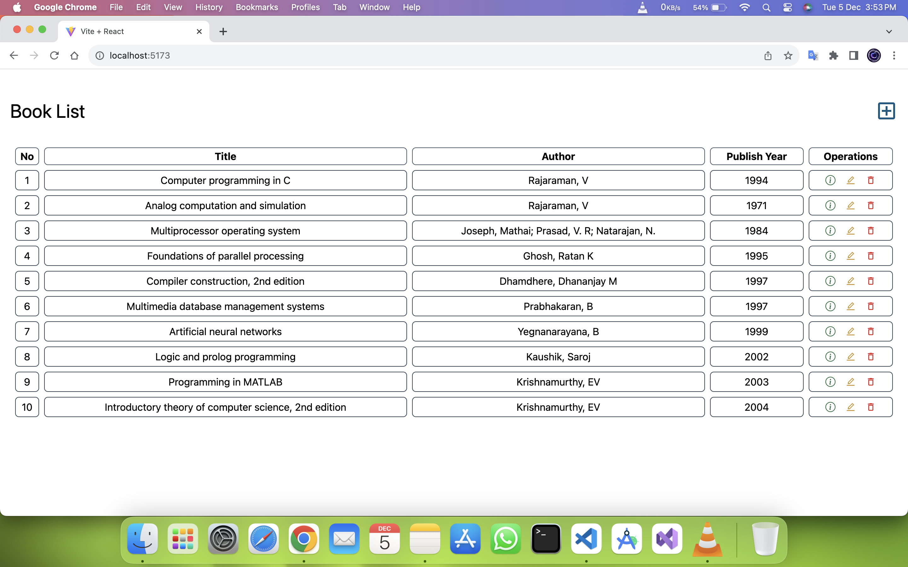

# BookStore-MERN-Stack

Welcome to the Bookstore MERN Stack project! This full-stack web application is designed to provide users with a seamless experience for browsing, searching, and purchasing books. Built on the MERN (MongoDB, Express.js, React.js, Node.js) stack, this project incorporates modern technologies to create a robust and efficient bookstore platform.

## Overview

This Bookstore MERN Stack project comprises a frontend developed with React.js and a backend powered by Node.js and Express.js. MongoDB is used as the database to store book information, and the application offers features such as browsing books, searching, user authentication, and a shopping cart for a complete e-commerce experience.

## Technologies Used
 - ** MongoDB Atlas
 - ** Express.js
 - ** React.js
 - ** Node.js
 - ** Vite for React
 - ** Axios for API requests
 - ** TailwindUi for styling

